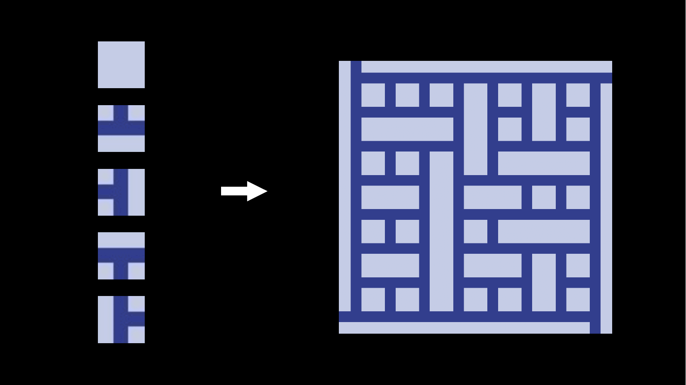
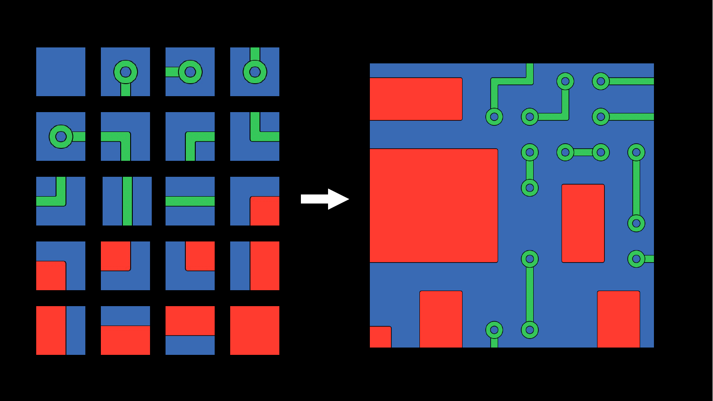

# wfc

This project implements procedural tile-based map generation using the Wave Function Collapse (WFC)

## Tile Maps generated


config file for this can be found at [./examples/t-spin/config.json](./examples/t-spin/config.json)


config file for this can be found at [./examples/shapes/config.json](./examples/shapes/config.json)

## Usage

- Clone the repo
```bash
git clone https://github.com/nishantHolla/wfc.git
cd wfc
```

- Build the project
```bash
make release
cd out
```

- Run the project with path to config file
```bash
./wfc [-s seed_number] [-o /path/to/output_image.png] /path/to/config.json
```

## Defining a config file

- Create a `config.json` file
- Define the `canvas` section with the properties of the image
```json
{
  "canvas": {
    "width": 1024,
    "height": 1024,
    "rows": 8,
    "columns": 8,
    "directions": "quad"
  },
}
```
    - `width`: Width of the output image in px.
    - `height`: Height of the output image in px.
    - `rows`: Number of rows in the output image.
    - `columns`: Number of columns in the output image
    - `directions`: Whether the rules are defined for 4 directions ("quad") or for 8 directions ("oct")

- Define the `tiles` section with the rules of each tile
```json
{
  "tiles": {
    "LEFT": {
      "path": "tiles/left.png",
      "rules": {
        "north": ["RIGHT", "LEFT", "DOWN"],
        "east": ["RIGHT", "BLANK"],
        "south": ["RIGHT", "LEFT", "UP"],
        "west": ["RIGHT", "DOWN", "UP"]
      }
    },

    "RIGHT": {
      "path": "tiles/right.png",
      "rules": {
        "north": ["RIGHT", "LEFT", "DOWN"],
        "east": ["LEFT", "DOWN", "UP"],
        "south": ["RIGHT", "LEFT", "UP"],
        "west": ["LEFT", "BLANK"]
      }
    }
}
```
    - Here two tiles with names `LEFT` and `RIGHT` are defined.
    - Each tile needs a path to its image which is relative to the config file.
    - Each tile also needs a list of rules for the directions around the tile
    - For "quad" directions use the labels "north", "east", "south", "west" to define the directions
      and for "oct" directions also add the labels "nort_east", "south_east", "south_west" and "north_west".
    - By providing a list of tile names for each direction, you restrict the set of tiles that can be
      generate in that direction of the tile.
    - For example: `"north": ["RIGHT", "LEFT"]` means that to the north of the current tile, only
      "LEFT" and "RIGHT" tile can be generated.
    - If no list of tiles is provided for a direction, then any tile from set of all tiles can be
      generated on that direction.
    - For example: `"!north": ["RIGHT", "LEFT"]` means that to the north of the current tile, any tile
      except "LEFT" and "RIGHT" tile can be generated.
    - By adding a `!` in front of the direction name, you can negate the list of tiles that can
      be generated in that direction.
- You can also split the tile definitions into multiple config files and include them in a single
config file like [this](./examples/shapes/config.json)
- Call the executable with the config file. You can pass a seed number for reproducibility and
also a path to the output file. When the window is open, you can press "r" to generate new images.
Once you are happy with the generated image, close the window to save the image.
```bash
./wfc -s 42 -o my_tile_image.png ./config.json
```
